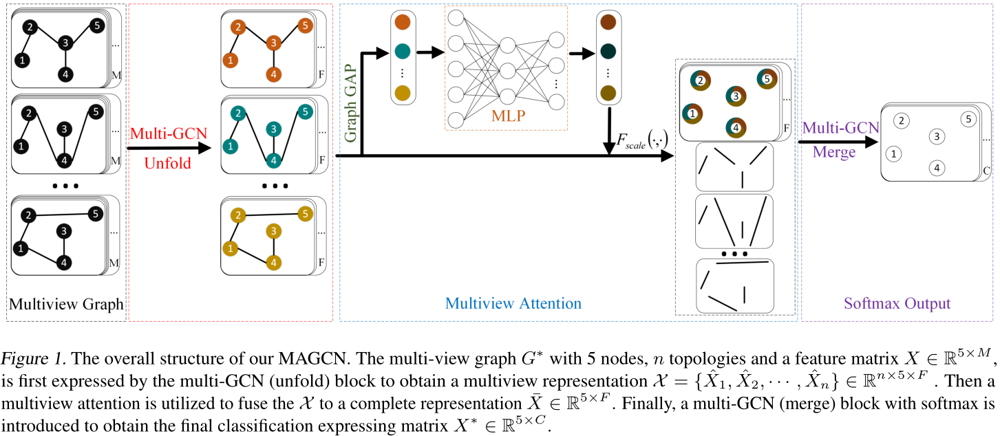
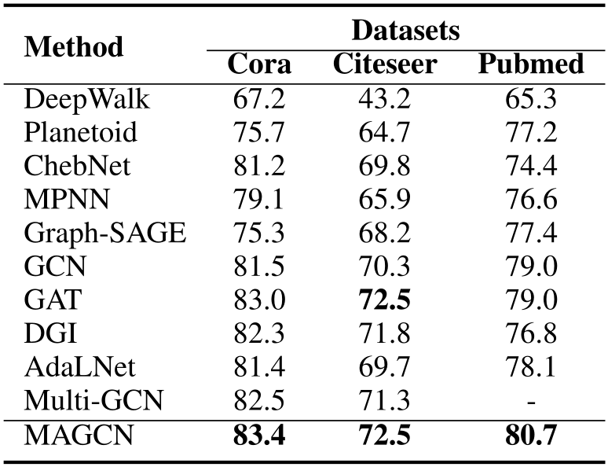
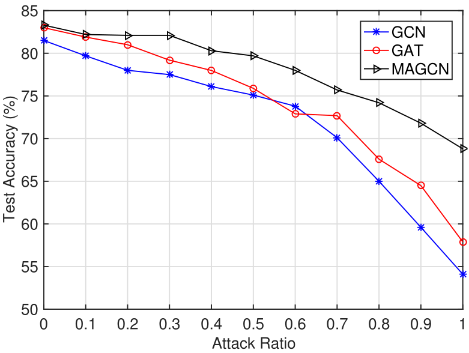
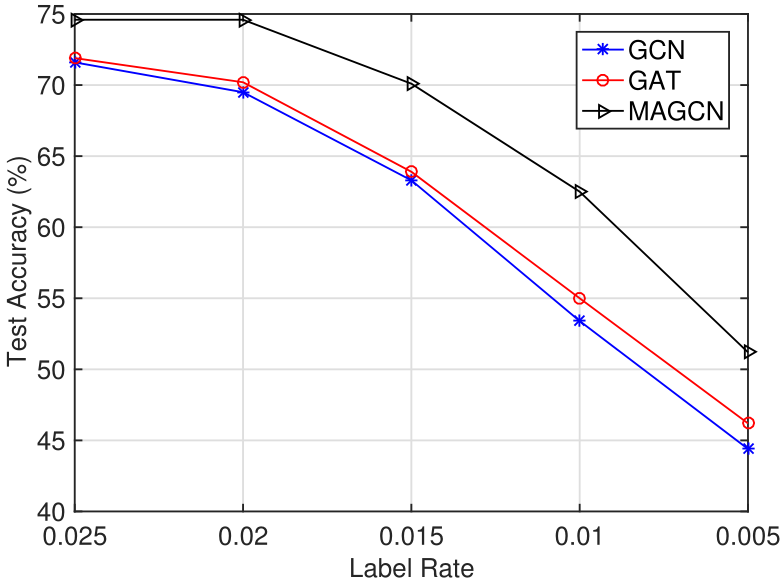
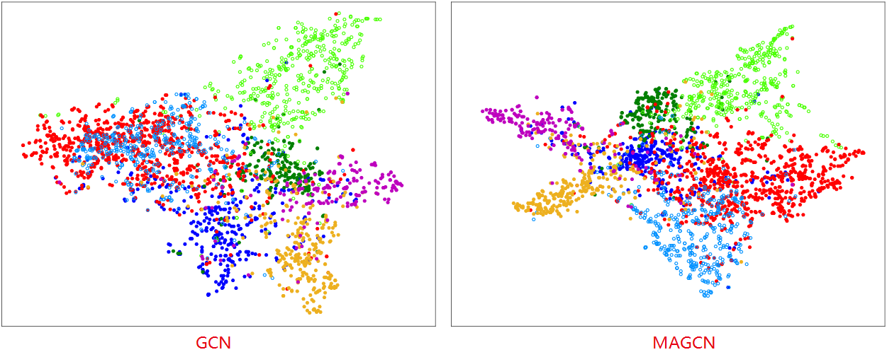
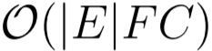
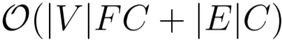

<h1 align = "center">Multi-View Graph Convolutional Networks with Attention Mechanism</h1>

<h1 align = "center">Abstract</h1> 

Recent advances in graph convolutional networks (GCNs), mainly focusing on how to exploit the information from different hops of neighbors in an efficient way, have brought substantial improvement on many graph data modelling tasks. Most of the existing GCN-based models however are built on the basis of a fixed adjacency matrix, i.e., a single view topology of the underlying graph. That inherently limits the expressive power of the developed models when the given adjacency matrix that is viewed as an approximation of the unknown graph topology does not fully reflect the `ideal' structure knowledge. In this paper, we propose a novel framework, termed Multiview Graph Convolutional Networks with Attention Mechanism (MAGCN), by incorporating multiple views of topology and attention based feature aggregation strategy into the computation of graph convolution. Furthermore, we present some theoretical analysis about the expressive power and flexibility of MAGCN, which provides a general explanation on why multi-view based methods can potentially outperform the ones relying on a single view. Our experimental study demonstrates the state-of-the-art accuracies of MAGCN on Cora, Citeseer, and Pubmed datasets. Robustness analysis is also given to show the advantage of MAGCN in handling some uncertainty issues in node classification tasks.

<h1 align = "center">Motivation</h1>

Despite that GCN and its variants/extensions have shown their great success on node classification tasks, almost all of these models are developed based on a fixed adjacency matrix given in advance, in other words, a single view graph topology. Inherently, the expressive power of the resulted model may be limited due to the potential information discrepancy between the adjacency matrix and the (unknown) target one. As such, it is logical to consider two practical questions: 

Q1: Is the given topology (adjacency matrix) trustable?

Q2: How to carry out the neighborhood aggregation or message passing when multi-view topologies of the graph are provided?

In this paper, we propose a novel framework, termed Multiview Graph Convolutional Networks with Attention Mechanism (MAGCN), by incorporating multiple views of topology and attention based feature aggregation strategy into the computation of graph convolution.

<h1 align = "center">Overview</h1>

    

<h1 align = "center">Experiments</h1>

## Semi-Supervised Classification.

<small> Table 1. Semi-supervised Classification Accuracy (%). </small>

    

## Robustness Analysis.

To further demonstrate the advantage of our proposed method, we test the performance of MAGCN, GCN and GAT when dealing with some uncertainty issues in the node classification tasks. Here we only use Cora dataset, and consider two types of uncertainty issues: random topology attack (RTA) and low label rates (LLR), that can lead to potential perturbations and affect the classification performance.

### Random Topology Attack (RTA)

    

<small> Figure 2. Test performance comparison for GCN, GAT, and MAGCN on Cora with different levels of random topology attack. </small>

### Low Label Rates (LLR)

    

<small> Figure 3. Test performance comparison for GCN, GAT, and MAGCN on Cora with different low label rates. </small>

<h1 align = "center">Visualization and Complexity</h1>

## Visualization

To illustrate the effectiveness of the representations of different methods, a recognized visualization tool t-SNE is utilized. Compared with GCN, the distribution of the nodes representations in a same cluster is more concentrated. Meanwhile, different clusters are more separated.

    

<small> Figure 4. t-SNE visualization for the computed feature representations of a pre-trained model's first hidden layer on the Cora dataset: GCN (left) and our MAGCN (right). Node colors denote classes. </small>

## Complexity

- **GCN** [1]: 
- **GAT** [2]: 
- **MAGCN**: 

Where  |V| and |E| are the numbers of nodes and edges in the graph, respectively. Although the introduction of multiple views multiplies the storage and parameter requirements by a factor of n compared with GCN, while the individual views’ computations are fully independent and can be parallelized. Overall, the computational complexity is on par with the baseline methods GCN and GAT.

<h1 align = "center">Conclusion</h1>

We propose in this paper a novel graph convolutional network model called MAGCN, allowing us to aggregate node features from different hops of neighbors using multi-view topology of the graph and attention mechanism. Theoretical analysis on the expressive power and flexibility is provided with rigorous mathematical proofs, showing a good potential of MAGCN over vanilla GCN model in producing a better node-level learning representation. Experimental results demonstrate that it yields results superior to the state of the art on the node classification task. Our work paves a way towards exploiting different adjacency matrices representing distinguished graph structure to build graph convolution.
